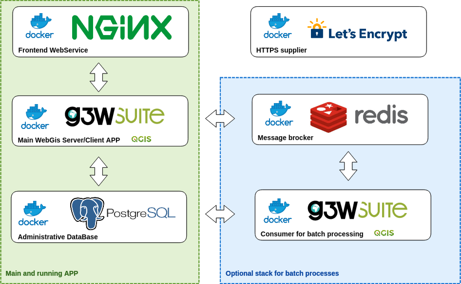
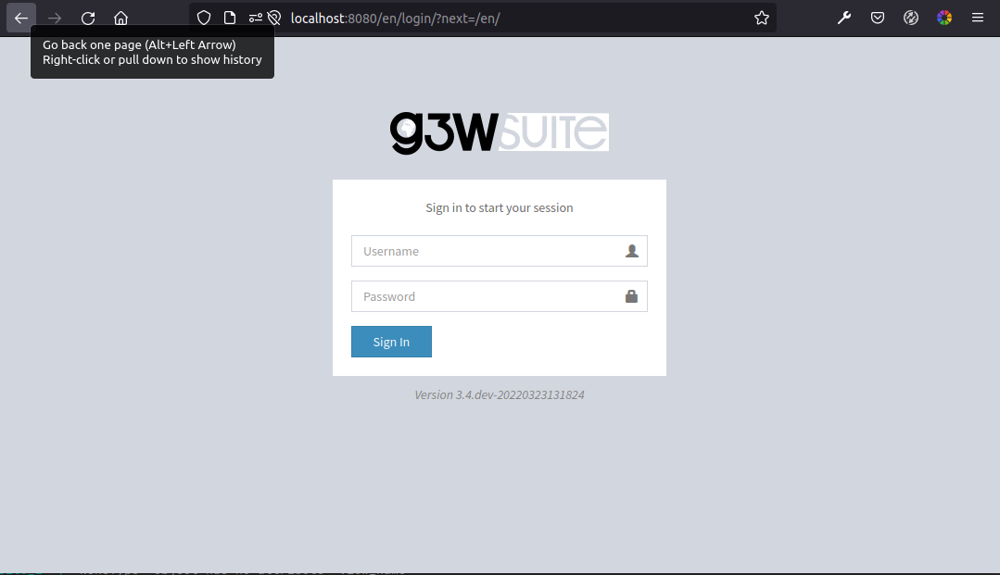

# G3W-SUITE-DOCKER

[](https://github.com/g3w-suite/g3w-suite-docker/actions/workflows/build_and_push_main_image.yml)
[](https://github.com/g3w-suite/g3w-suite-docker/actions/workflows/build_and_push_deps_ltr.yml)

Run a full blown web-gis application with Docker Compose

<details>

<summary><h2> ⬆️ How to upgrade from v3.7 to v3.8 </h2></summary>

Since **v3.8** PostgreSQL/PostGIS changed from **v11/2.5** to **v16/3.4**, to upgrade follow below steps:

```sh
# NB:
# • (ENV = dev)      → docker-compose-dev.yml
# • (ENV = prod)     → docker-compose.yml
# • (ENV = consumer) → docker-compose-consumer.yml

### BACKUP (v3.7.x) ###

docker compose up -f docker-compose-dev.yml up -d

git fetch
git checkout v3.8.x

make db-backup PG_VERSION=11 ENV=dev

### RESTORE (v3.8.x) ###

make db-reset ENV=dev
make db-restore PG_VERSION=11 ENV=dev

### OPTIONAL (delete old DB) ###

docker compose exec g3w-suite bash -c 'rm -r /shared-volume/11'
```
  
</details>

---




## 🌍 Deploying your webgis app

Install [docker compose](https://docs.docker.com/compose/install/).

Clone this repository:

```
git clone https://github.com/g3w-suite/g3w-suite-docker/
cd g3w-suite-docker
```

Create a `.env` file starting from [`.env.example`](./.env.example) and tailor it to your needs:

```diff
# CHANGE ME: PostGIS DB password

- G3WSUITE_POSTGRES_PASS='89#kL8y3D'
+ G3WSUITE_POSTGRES_PASS=<your__password>
```

Start containers:

```sh
docker-compose up -d
```

or, if you intend to use [huey](https://github.com/coleifer/huey) (batch processing)

```sh
docker-compose -f docker-compose-consumer.yml up -d
```

**NB:** at the very first start, have a lot of patience 😴 → the system must finalize the installation. \*

After some time the suite will be available at:

- http://localhost:8080 (user: `admin`, pass: `admin`)



\* in case of faulty container (eg. the first time you didn't wait long enough before trying to access):

```sh
# 🚨 deletes all data
make db-reset ENV=prod

# or
# make db-reset ENV=consumer 
```

## 💻 How to access into a container 

1. check the container name (eg. `postgis` → `g3wsuitedocker_postgis_1`)

```bash
$ docker ps | grep postgis
84ef6a8d23e6        g3wsuite/postgis:11.0-2.5       "/bin/sh -c /docker-…"   2 days ago          Up 2 days           0.0.0.0:5438->5432/tcp           g3wsuitedocker_postgis_1
```

2. Log into the container

```bash
$ docker exec -it g3wsuitedocker_postgis_1 bash
```

3. perform your administrative tasks (eg. connect to postgis as "postgres" user):

```bash
root@84ef6a8d23e6:/# su - postgres

postgres@84ef6a8d23e6:~$ psql
psql (11.2 (Debian 11.2-1.pgdg90+1))
Type "help" for help.

postgres=#
```

## 🔒 HTTPS

To enable https with LetsEncrypt::

- uncomment ssl section within `config/nginx/nginx.conf`
- update `WEBGIS_PUBLIC_HOSTNAME` environment variable within the `.env` and `config/nginx/nginx.conf` files
- launch `sudo make renew-ssl`
- make sure the certs are renewed by adding a cron job with `sudo crontab -e` and add the following line:
  `0 3 * * * /<path_to_your_docker_files>/run_certbot.sh`

## 📦 Docker image

Docker compose will usually download images from: https://hub.docker.com/u/g3wsuite 

A custom (local) docker image for the suite can be created with:

```bash
docker build -f Dockerfile.g3wsuite.dockerfile -t g3wsuite/g3w-suite:dev --no-cache .

# OPTIONAL:
# docker build -f Dockerfile.g3wsuite-deps.ltr.dockerfile -t g3wsuite/g3w-suite-deps-ltr:dev --no-cache .
```

The image is build on latest Ubuntu and QGIS LTR, following this execution order:

1. [Dockerfile.g3wsuite-deps.ltr.dockerfile](./Dockerfile.g3wsuite-deps.ltr.dockerfile) ← installs Ubuntu and QGIS LTR
2. [Dockerfile.g3wsuite.dockerfile](./Dockerfile.g3wsuite.dockerfile)  ← run "setup.sh" and "docker-entrypoint.sh"
3. [scripts/setup.sh](./scripts/setup.sh) ← install g3w-admin and some other python plugins
4. [scripts/docker-entrypoint.sh](./scripts/docker-entrypoint.sh) ← start gunicorn

## 🎨 Style customization

- custom templates folder: `config/g3w-suite/overrides/templates` → a Docker service restart is required to make the changes effective.
- custom logo (see: [docs](https://g3w-suite.readthedocs.io/en/latest/settings.html#general-layout-settings)): `config/g3w-suite/settings_docker.py` → a Docker service restart is required to make the changes effective.
- custom CSS: `config/g3w-suite/overrides/static/style.css` → changes are effective immediately

## 🚀 Performance optimizations

1. set scale-dependent visibility for the entire layer or for some filtered features (example: show only major roads until at scale 1:1E+6)
2. when using rule-based/categorized classification or scale-dependent visibility create indexes on the column(s) involved in the rule expression (example: "create index idx_elec_penwell_ious on elec_penwell_ious (owner);" )
3. start the project with only a few layers turned on by default
4. do not turn on by default base-layers XYZ such as (Google base maps)
5. do not use rule-based/categorized rendering on layers with too many categories (example: elec_penwell_public_power), they are unreadable anyway
6. enable redering simplification for not-point layers, set it to `Distance` `1.2` and check `Enable provider simplification if available`
7. enable cache on linestring and polygon layers (tile cache can be configured and cleared per-layer through the webgis admin panel and lasts forever until it is disabled or cleared)
8. set a cron job on host machine that checks edited features that have been locked for more than 4 hours and frees them:
```
0 */1 * * * docker exec g3w-suite-docker_g3w-suite_1 python3 /code/g3w-admin/manage.py check_features_locked
```

## 🐋 Portainer usage

Portainer (https://www.portainer.io) is a docker-based web application used to edit and manage Docker applications in a simple and intuitive way.

Plese refer to the [Add new stack]([https://docs.portainer.io/v/ce-2.9/user/docker/stacks/add](https://docs.portainer.io/user/docker/stacks/add)) section to learn how to deploy the `docker-compose-consumer.yml` stack with Portainer (>= v2.1.1).


## ♻️ Database backup / restore 

```sh
# NB:
# • (ENV = dev)      → docker-compose-dev.yml
# • (ENV = prod)     → docker-compose.yml
# • (ENV = consumer) → docker-compose-consumer.yml

docker compose up -f docker-compose.yml up -d

make backup-db PG_VERSION=16 ENV=prod
make restore-db PG_VERSION=16 ENV=prod
```

### Contributors

* GIS3W: [wlorenzetti](https://github.com/wlorenzetti), [raruto](https://github.com/Raruto)
* ItOpen: [elpaso](https://github.com/elpaso)
* Kartoza: [NyakudyaA](https://github.com/NyakudyaA)
* QTIBIA: [tudorbarascu](https://github.com/tudorbarascu)
