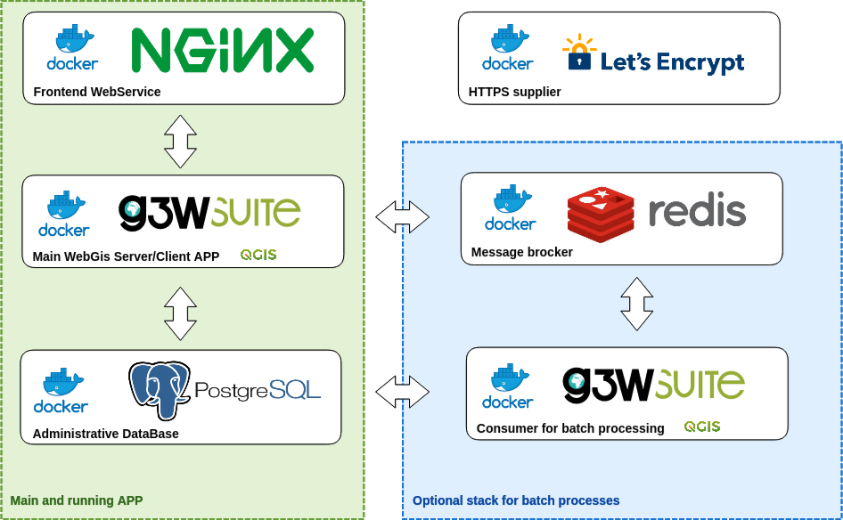
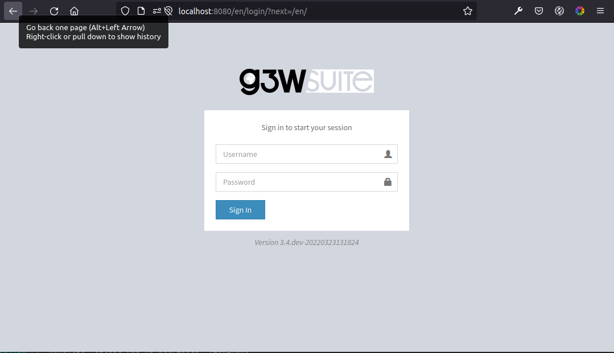

# G3W-SUITE-DOCKER

[](https://github.com/g3w-suite/g3w-suite-docker/actions/workflows/build_and_push.yml)

Run a self hosted web-gis application with Docker Compose

<details>

<summary><h2> ⬆️ How to upgrade your webgis</h2></summary>

To upgrade your containers (eg. `v3.10.x` → `v3.11.x`):

```sh
### BACKUP (v3.10.x) ###

make reload

git fetch
git checkout v3.11.x

make db-backup ID=310

### RESTORE (v3.11.x) ###

make db-restore ID=310

### OPTIONAL (delete old DB) ###

docker compose exec g3w-suite bash -c 'rm -r /shared-volume/310'
docker compose exec g3w-suite bash -c 'rm -r /shared-volume/backup/310'
```
  
</details>

---



## ✨ AI Assistant

[](https://deepwiki.com/g3w-suite/g3w-suite-docker)


## 🌍 Deploying your webgis app

Install [make](https://www.gnu.org/software/make/) and [docker compose](https://docs.docker.com/compose/install/).

Clone this repository:

```
git clone https://github.com/g3w-suite/g3w-suite-docker/
cd g3w-suite-docker
```

And then start containers:

```sh
make deploy
```

**NB:** at the very first start, have a lot of patience 😴 → the system must finalize the installation. \*

After some time the suite will be available at:

- http://localhost:8080 (user: `admin`, pass: `admin`)



\* in case of faulty container (eg. the first time you didn't wait long enough before trying to access):

```sh
# 🚨 deletes all data
make db-reset
```

## 💻 How to access into a container 

1. login into a service

```sh
$ make run-postgis

# make run-g3w-suite
# make run-nginx
# make run-redis
```

2. perform your administrative tasks (eg. connect to postgis as "postgres" user):

```sh
root@84ef6a8d23e6:/# su - postgres

postgres@84ef6a8d23e6:~$ psql
psql (11.2 (Debian 11.2-1.pgdg90+1))
Type "help" for help.

postgres=#
```

## 🔒 HTTPS

Run deploy wizard again and enable the LetsEncrypt Certbot when prompted.

```sh
make deploy
```

## 📦 Installing MSSQL & Oracle drivers

⚠️ By using these flags you accept the [Microsoft EULA](https://learn.microsoft.com/en-us/sql/connect/odbc/linux-mac/installing-the-microsoft-odbc-driver-for-sql-server) and [Oracle OTN](https://www.oracle.com/downloads/licenses/standard-license.html) license.

Run deploy wizard again and set `INSTALL_MSSQL=true` and `INSTALL_ORACLE=true` flags when prompted.

```bash
make deploy
```

You can refer to the **multi-stage** [Dockerfile](./Dockerfile) and [docker-bake.hcl](./docker-bake.hcl) for more info about these flags / dependencies installed.

## 🎨 Style customization

- **Custom Templates**: edit `config/g3w-suite/overrides/templates` → (docker restart required)
- **Custom Logo**: edit `config/g3w-suite/settings_docker.py` → (docker restart required)
- **Custom CSS**: edit `config/g3w-suite/overrides/static/style.css` → (changes are effective immediately)

For more info see: [branding the suite](https://g3w-suite.readthedocs.io/en/latest/branding.html) and [general layout settings](https://g3w-suite.readthedocs.io/en/latest/settings.html#general-layout-settings).

## 🚀 Performance optimizations

- Set scale-dependent visibility for dense layers.
- Create database indexes on columns used for styling or visibility rules.
- Keep just a few layers turned on by default (when loading the project).
- Keep XYZ base maps (like Google Maps) disabled by default.
- Avoid rule-based styling with too many categories.
- Enable rendering simplification for lines and polygons (eg. set it to `Distance` `1.2` and check `Enable provider simplification if available`).
- Enable tile cache for line and polygon layers (can be configured through the g3w-admin panel and lasts forever until it is disabled or cleared)
- Run a cron job to automatically unlock locked features:

```bash
0 */1 * * * docker exec g3w-suite-docker_g3w-suite_1 python3 /code/g3w-admin/manage.py check_features_locked
```

## 🐋 Portainer usage

Portainer (https://www.portainer.io) is a docker-based web application used to edit and manage Docker applications in a simple and intuitive way.

Plese refer to the [Add new stack](https://docs.portainer.io/user/docker/stacks/add) section to learn how to deploy the `docker-compose.yml` stack with Portainer (>= v2.1.1).

## ♻️ Database backup / restore

```sh
make reload

make db-backup ID=foo-backup
make db-restore ID=foo-backup
```

## 🛠️ Developers

<details>
<summary> 1. How to Develop </summary>

1. Copy `.env.example` file into `.env` and edit it: 
   * set `G3WSUITE_LOCAL_CODE_PATH=../g3w-admin` (path to your local G3W-ADMIN repository).

2. Run `make dev`, if all went well: \*
   * G3W-SUITE is running in development mode on http://127.0.0.1:8000
   * G3W-ADMIN is available at [`./code`](./code)

---
<sub> \* if necessary, comment out any missing installed modules from [G3WADMIN_LOCAL_MORE_APPS](./config/g3w-suite/settings_docker.py) list and then try again </sub>

<sub> \* if you customize [docker-compose.yml](./docker-compose.yml) (eg. by choosing a specific <code>image: <del>g3wsuite/g3w-suite:dev</del> g3wsuite/g3w-suite:v3.7.x</code>) you then apply them via: `make dev` </sub> 

</details>

<details>
<summary> 2. Loading default demo </summary>

```
# 🚨 deletes all data
make db-restore ID=demo

# or (a custom backup):

# make db-backup  ID=foo-backup
# make db-restore ID=demo
# ...
# make db-restore ID=foo-backup
```

</details>

<details>
<summary> 3. Developing a python plugin (pip install) </summary>

Below you can find some sample plugins from which to take inspiration:

- https://github.com/g3w-suite/g3w-admin-ps-timeseries
- https://github.com/g3w-suite/g3w-admin-processing
- https://github.com/g3w-suite/g3w-admin-authjwt

For example, installing a plugin within the docker container (editable mode):

```
make run-g3w-suite
mkdir -p /shared-volume/plugins
git clone https://github.com/g3w-suite/g3w-admin-ps-timeseries
pip3 install -v -e /shared-volume/plugins/qps_timeseries
exit
```

**NB:** If the above seems wordy to you, you can also inject a custom script within: [scripts/docker-entrypoint.sh](./scripts/docker-entrypoint.sh)

</details>

<details>
<summary> 4. Developing a python plugin (git only) </summary>

Below are the steps to develop a new Django app into g3w-admin (as git submodule).

```bash

## Fork g3w-suite (docker + admin)  ##

git clone https://github.com/YOUR-USERNAME/g3w-suite-docker
git clone https://github.com/YOUR-USERNAME/g3w-admin

## Create dev branches (v3.7.8_my-fantastic-plugin) ##

cd g3w-suite-docker
git remote add gis3w https://github.com/g3w-suite/g3w-suite-docker
git checkout v3.7.8 
git checkout -b v3.7.8_my-fantastic-plugin
git push origin v3.7.8_my-fantastic-plugin

cd g3w-admin
git remote add gis3w https://github.com/g3w-suite/g3w-admin
git checkout v3.7.8 
git checkout -b v3.7.8_my-fantastic-plugin
git push origin v3.7.8_my-fantastic-plugin

## Add your plugin into g3w-admin (as git submodule) ##

cd g3w-admin
git submodule add https://github.com/YOUR-USERNAME/my-plugin my-plugin
```

Now customize [.env](./.env) and [settings_docker.py](./config/g3w-suite/settings_docker.py) files to fit your needs, eg:

```bash
# .env
WEBGIS_DOCKER_SHARED_VOLUME=/SHARED_VOLUME/
G3WSUITE_DEBUG=True
G3WSUITE_LOCAL_CODE_PATH=/home/gis3w/g3w-admin/
```

```python
# settings_docker.py
G3WADMIN_LOCAL_MORE_APPS = [
  'caching',
  'editing',
  'filemanager',
  'qplotly',
  'openrouteservice',
  'qtimeseries',
  'my-plugin', # ← YOUR CUSTOM PLUGIN 
]
```

Reload the containers: 

```bash
    make dev
```

</details>

<details>
<summary> 5. Attach the python debugger (vscode) </summary>

1. Install the [Python Debugger](https://marketplace.visualstudio.com/items?itemName=ms-python.debugpy) extension.

2. Start containers in development mode:

```bash
    make dev # symlinks `G3WSUITE_LOCAL_CODE_PATH` → `./code` and enables live reload
```

3. Start the built-in debugger ([`Run and Debug > G3W-SUITE-DOCKER: Debugger`](.vscode\launch.json))

4. You should now be able to set breakpoints, step through code, inspect variables, ...

**For more info:**

- https://code.visualstudio.com/docs/python/debugging
- https://code.visualstudio.com/docs/containers/overview

</details>

<details>
<summary> 6. Connecting to a local DB (PostGIS) </summary>

If you are working in a mixed setup (ie. a local [postgis](https://postgis.net/) instance + a [g3w-suite-docker](https://github.com/g3w-suite/g3w-suite-docker) container), you should add an `extra_hosts` directive within your `docker-compose.yml` to make your local postgres databases accessible from both sides:


```yaml

  g3w-suite:
    image: g3wsuite/g3w-suite:dev

    ...

    extra_hosts:
      - "postgis16:host-gateway"
```

taking care to edit your `hosts` file accordingly:

```sh
# Added for G3W-SUITE docker
127.0.0.1 postgis16
```

**For more info:**

- https://docs.docker.com/compose/compose-file/compose-file-v3/#extra_hosts

</details>


### Contributors

* GIS3W: [wlorenzetti](https://github.com/wlorenzetti), [raruto](https://github.com/Raruto)
* ItOpen: [elpaso](https://github.com/elpaso)
* Kartoza: [NyakudyaA](https://github.com/NyakudyaA)
* QTIBIA: [tudorbarascu](https://github.com/tudorbarascu)
