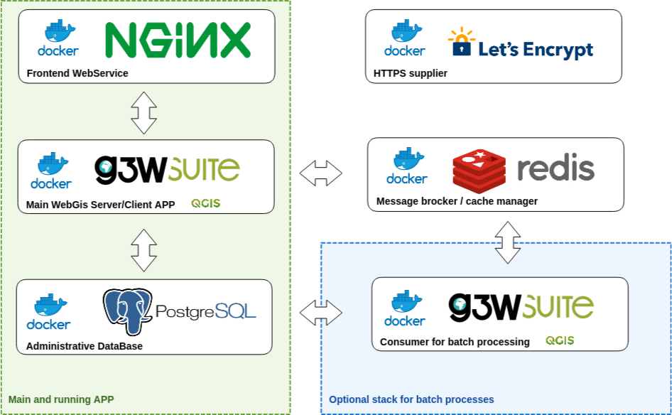

# G3W-SUITE WebGIS

[](https://github.com/g3w-suite/g3w-suite-docker/actions/workflows/build_and_push_main_image.yml)
[](https://github.com/g3w-suite/g3w-suite-docker/actions/workflows/build_and_push_deps_ltr.yml)

This repository contains scripts and recipes for deploy of the G3W-SUITE web-gis application with Docker and
docker-compose .



## Deploy

In order to deploy a running instance of `G3W-SUITE` follow the steps outlined below:

### Configuration 

* Copy the sample env file:

  ```bash
    cp .env.example .env
  ```
* Update the credentials specified in `.env` from the defaults. It is encouraged to use passwords
which are difficult to guess especially when deploying in production environments.

Example of environment variables that are available in the `.env` file are listed below:

```bash
# External hostname, for docker internal network aliases
WEBGIS_PUBLIC_HOSTNAME=demo.g3wsuite.it/

# This volume is persistent and mounted by all
# containers as /shared-volume
WEBGIS_DOCKER_SHARED_VOLUME=/tmp/shared-volume-g3w-suite


# DB setup
G3WSUITE_POSTGRES_USER_LOCAL=g3wsuite
G3WSUITE_POSTGRES_PASS=<your_password>
G3WSUITE_POSTGRES_DBNAME=g3wsuite
G3WSUITE_POSTGRES_HOST=postgis
G3WSUITE_POSTGRES_PORT=5432


# QGIS Server env variables
# ----------------------------------------------------
PGSERVICEFILE=/pg_service/pg_service.conf
```

### Run

```bash
docker-compose up -d
```

If all went well, G3W-SUITE run on http://localhost:8080


## G3W-SUITE with consumer image
G3W-SUITE use `huey` for bach processing (https://github.com/coleifer/huey), so if you want to use it,
use `docker-compose-consumer.yml` file on deploy:
```bash
docker-compose -f docker-compose-consumer.yml up -d
```

## Builds

The docker-compose recipes will download images from docker hub (https://hub.docker.com/u/g3wsuite).
Alternatively you can build the images locally using the dockerfiles available in the repository. 

#### G3W-SUITE

The main suite docker image can be built with:

```bash
  docker-compose -f docker-compose-build.yml build 
```

Where the builds arguments are:

```bash
  ARG DISTRO=ubuntu
  ARG IMAGE_VERSION=jammy
  ARG QGIS_LTR=-ltr
  ARG INSTALL_MSSQL=false
```

The image is build from `https://github.com/g3w-suite/g3w-admin.git --branch dev` 

Usually is sufficient make build of main docker image `g3wsuite/g3w-suite:dev`, 
the build of dependence image `g3wsuite/g3w-suite-deps-ltr:dev` is done to update last QGIS LTR version.

## Setups

### PG_SERVICE in G3W Suite Container

To make use of PostgreSQL service configuration, put your service definitions in 
`./secrets/pg_service.conf file`, the conf file will be mounted into docker container at runtime to 
`PGSERVICEFILE` path position.

### HTTPS additional setup

To provision the site with https using LetsEncrypt certificates, follow the procedure below:

* Move `config/_nginx/django_ssl.conf` to `config/nginx/django_ssl.conf`
* Check the domain name in the `.env` file and in `config/nginx/django_ssl.conf`
* Run: `docker pull certbot/certbot`
* Launch `./run_certbot.sh`
* Activate 301 redirect into `config/nginx/django.conf`
* Restart compose
* Make sure the certs are renewed by adding a cron job with `crontab -e` and add the following line:
  `0 3 * * * /<path_to_your_docker_files>/run_certbot.sh`
* If you disabled HTTPS, you can move `config/nginx/django_ssl.conf` back to its original location now, and restart 
the Docker compose to finally enable HTTPS

TODO: Automate the above in the docker recipe.

### Volumes

Data, projects, uploads and the database are stored in a shared mounted volume `shared-volume`, the volume should be 
on a persistent storage device and a backup policy must be enforced.

Currently, the volume is mounted in `./shared-volume`. In production environments it is encouraged to change this 
to a permanent location. This can be done by modifying the `.env` file.

### First time setup

* Log into the application web administration panel using default credentials (_admin/admin_)
* Change the password for the admin user and for any other example user that may be present.
* You can also create new users using the Django admin console using the following:
  ```bash
    docker-compose exec g3w-suite python3 /code/g3w-admin/manage.py createsuperuser
  ```
You can also check other commands you can administer by running:
  ```bash
     docker-compose exec g3w-suite python3 /code/g3w-admin/manage.py --help
  ```
### Caching

Tile cache can be configured and cleared per-layer through the webgis admin panel and lasts forever until it 
is disabled or cleared.

> Tip: enable cache on linestring and polygon layers.

### Editing

Editing module is active by default, to avoid simultaneous feature editing by two or more users, the editing module 
works with a feature lock system. This locking system can remain active if users do not exit the editing state 
correctly, to avoid this it is advisable to activate a cron job on host machine that checks the features that have 
been locked for more than 4 hours and frees them:

```
0 */1 * * * docker exec g3w-suite-docker_g3w-suite_1 python3 /code/g3w-admin/manage.py check_features_locked
```

## Front-end App

Set the environment variable
```
FRONTEND=True
```
This will set the front end app as the default app

## Style customization

Templates can now be overridden by placing the overrides in the `config/g3w-suite/overrides/templates`, 
a Docker service restart is required to make the changes effective.

The logo is also overridden (through `config/g3w-suite/settings_docker.py` which is mounted as a volume), changes 
to the settings file require the Docker service to be restarted.

A custom CSS is added to the pages, the file is located in `config/g3w-suite/overrides/static/style.css` and can be 
modified directly, changes are effective immediately.

## Performances optimization

General rules (in no particular order: they are all mandatory):

1. Set scale-dependent visibility for the entire layer or for some filtered features (example: show only major roads
until at scale 1:1E+6)
2. When using rule-based/categorized classification or scale-dependent visibility create indexes on the column(s) 
involved in the rule expression (example: "create index idx_elec_penwell_ious on elec_penwell_ious (owner);" )
3. Start the project with only a few layers turned on by default
4. Do not turn on by default base-layers XYZ such as (Google base maps)
5. Do not use rule-based/categorized rendering on layers with too many categories (example: elec_penwell_public_power),
they are unreadable anyway
6. Enable rendering simplification for not-point layers, set it to `Distance` `1.2` and check 
`Enable provider simplification if available`

## PostgreSQL administration

Postgres is running in a Docker container, in order to access the container, you can follow the instruction below:

### Log into the container

```bash
$ docker-compose exec postgis bash
```

### Become postgres user

```bash
root@84ef6a8d23e6:/# su - postgres
```
**Note:** It is not recommended to run as postgres user.

### Connect to postgis

```bash
postgres@84ef6a8d23e6:~$ psql
psql (11.2 (Debian 11.2-1.pgdg90+1))
Type "help" for help.

postgres=#
```

## Portainer usage

Portainer (https://www.portainer.io) is a docker-based web application used to edit and manage Docker applications 
in a simple and intuitive way.

Please refer to the [Add new stack](https://docs.portainer.io/v/ce-2.9/user/docker/stacks/add) section to learn how 
to deploy the `docker-compose-consumer.yml` stack with Portainer (>= v2.1.1).

### Contributors
* Walter Lorenzetti - Gis3W ([@wlorenzetti](https://github.com/wlorenzetti))
* Alessandro Pasotti - ItOpen ([@elpaso](https://github.com/elpaso))
* Admire Nyakudya - Kartoza ([@NyakudyaA](https://github.com/NyakudyaA))
